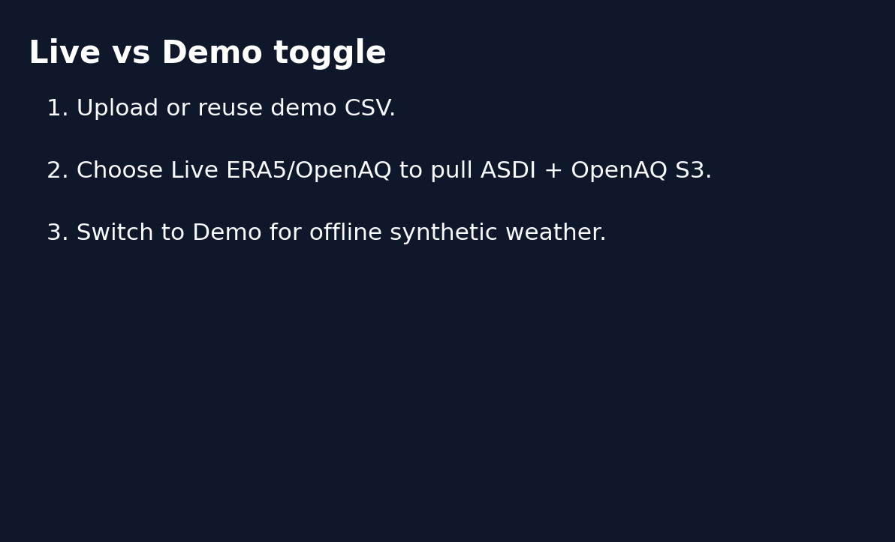
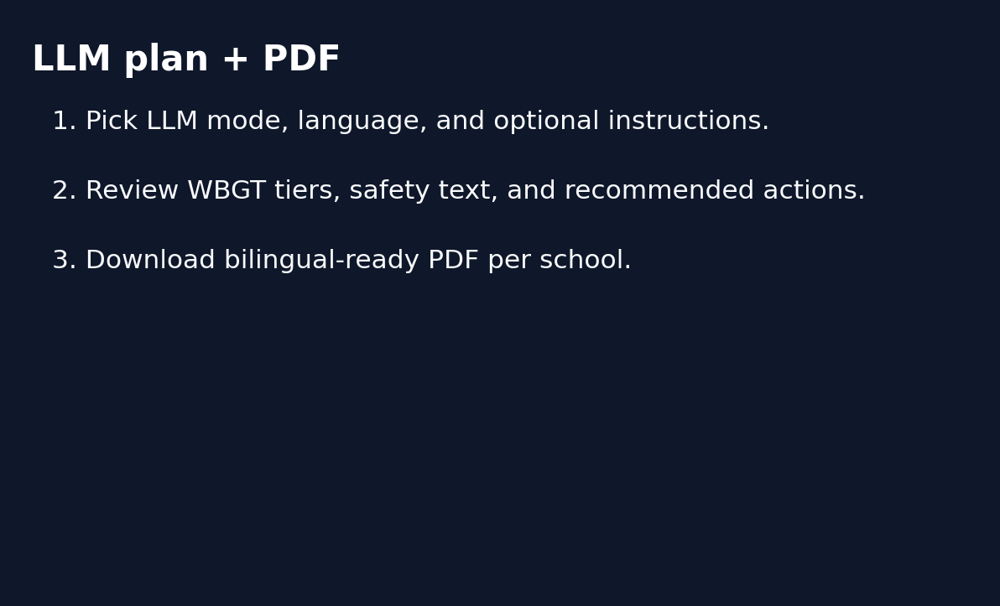

# HeatShield Demo (90 seconds)

## 1. Launch
1. `docker compose up --build` (or run the FastAPI + Streamlit commands from the README).
2. Visit `http://localhost:8501` and keep the FastAPI docs open at `http://localhost:8000/docs` for quick inspection.

## 2. Walkthrough
1. **Select schools & data mode** — Upload your CSV or fall back to the bundled demo file. Use the data toggle to switch between Demo (synthetic) and Live (ASDI ERA5 + OpenAQ S3). When in Live mode, watch the API logs for `ERA5 fetched from S3 (ASDI)` or `OpenAQ S3 ... fallback`, confirming provenance.  
   
2. **Choose planner + language** — Pick `rule` for deterministic guidance or `llm` to unlock natural-language plans. Select the target language (English, Spanish, French, Portuguese, Haitian Creole) and optionally add extra instructions (e.g., “Call out after-school athletics”). These settings flow straight into `/plan`.  
   
3. **Review risk + plan** — For each school, inspect the JSON summary, confirm source metadata (met vs. AQ), and read the generated plan. Download the PDF to share with principals or families. Finish with the Pydeck map to show district-wide risk tiers.

## 3. Tips
- Run `python verify_live.py --lat 34.0522 --lon -118.2437 --date 2024-07-01` to validate ASDI/OpenAQ connectivity before demos.
- Streamlit reads `HEATSHIELD_API`, so you can point the UI at a remote API instance without code changes.
- Share this doc plus the screenshots with comms teams—they can narrate the entire experience in under 90 seconds.
