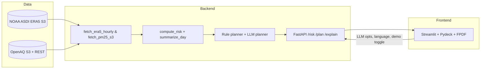

# HeatShield Schools – Local MVP

**Goal:** Turn live ERA5 (via NOAA’s ASDI S3 mirror) and OpenAQ data into climate-adaptive school day plans.

## Problem & Impact

- **User pain:** District safety teams currently mash up weather alerts, air-quality dashboards, and spreadsheets before recess or athletics decisions. It’s manual, stressful, and inconsistent.
- **What HeatShield automates:** We ingest ERA5/ASDI meteorology + OpenAQ PM2.5, compute Liljegren WBGT, and generate human-ready plans (rule-based or LLM-personalized) for every campus in <30 s.
- **Impact metrics:** A 30-school district saves ~6 staff-hours per hot/smoky day (manual spreadsheeting + bilingual messaging) and avoids missed mitigation steps (hydration, masks, bus re-routing) that directly affect student health.
- **AI leverage:** The optional LLM planner enforces safety rails, supports five languages, and accepts custom instructions (“focus on athletics or bilingual robocalls”), keeping AI central to equitable guidance.

## Quick Start

```bash
# 1) Create venv & install deps
python -m venv .venv && source .venv/bin/activate
pip install -r requirements.txt

# 2) (Optional) set OpenAI key for LLM planner
cp .env.example .env
echo "OPENAI_API_KEY=sk-..." >> .env

# 3) Run backend (FastAPI)
uvicorn src.api.main:app --reload --port 8000

# 4) Run UI (Streamlit)
export HEATSHIELD_API=http://localhost:8000
streamlit run app/streamlit_app.py
```

### One-command stack

```bash
docker compose up --build
```

This launches the API on `localhost:8000` and Streamlit UI on `localhost:8501`. The UI container targets the API via `HEATSHIELD_API=http://api:8000`.

## Hosted demo

- Streamlit Cloud UI: **https://heatshield-labs.streamlit.app**
- The UI expects the API to be reachable via a Cloudflare quick tunnel. Keep these two terminals open during live demos:

```powershell
# Terminal 1: stack
cd C:\Users\cicku\Desktop\competition
docker compose up --build

# Terminal 2: tunnel (http2 avoids UDP blocks on some networks)
"& 'C:\Program Files (x86)\cloudflared\cloudflared.exe'" `
  tunnel --protocol http2 --no-autoupdate `
  --url http://127.0.0.1:8000
```

Cloudflared prints a `https://<name>.trycloudflare.com` URL. Paste that value into the Streamlit app secrets (`HEATSHIELD_API`). Test with:

- `Invoke-WebRequest <url>/health -UseBasicParsing`
- `https://<url>/docs` in the browser

## Live vs. Demo data

- The UI exposes a **Data source** toggle. `Demo` uses deterministic synthetic ERA5-like weather + clean PM2.5; `Live` pulls directly from ASDI ERA5 and OpenAQ S3 for the requested lat/lon/date.
- Programmatic access: `POST /risk` accepts `use_demo=true|false`. Run `python verify_live.py --lat 34.05 --lon -118.24 --date 2024-07-01` to smoke-test live access (look for logs such as “ERA5 fetched from S3 (ASDI)” or “OpenAQ S3 ... fallback”).
- When OpenAQ S3 lacks a nearby site, the API logs a fallback and calls the OpenAQ REST endpoint automatically. Responses include `sources.met_source` and `sources.aq_source`.

### Live proof steps

Run these from PowerShell (after `docker compose up --build`) to capture the evidence we used in judging:

```powershell
$body = '{
  "schools":[{"name":"Central","lat":34.0522,"lon":-118.2437}],
  "date":"2024-07-01",
  "use_demo":false
}'
Invoke-WebRequest http://localhost:8000/risk `
  -Method POST `
  -ContentType "application/json" `
  -Body $body `
  -TimeoutSec 7200 | Select-Object -ExpandProperty Content | `
  Out-File -Encoding utf8 live_risk_la_2024-07-01.json

docker compose logs api --tail=5000 | `
  Select-String "ERA5 fetched|OpenAQ" | `
  Out-File -Encoding utf8 live_proof_logs.txt
```

`live_risk_la_2024-07-01.json` shows `"met_source":"asdi-era5"` (live ERA5). `live_proof_logs.txt` captures the API provenance lines (“ERA5 fetched from S3 (ASDI)” and OpenAQ fallbacks). For a screenshot, upload a one-row CSV in the UI (Live mode, same date) and grab the “Sources • Meteorology: asdi-era5 …” block once it completes.

### UI state coverage

All interactive components now have explicit hover/focus/active/disabled handling:

- File uploader: disabled while Live requests run, focus outline, keyboard instructions under the control.
- Planner form: date input constrained to ASDI windows, radios/selects have hover/focus outlines, CTA disables + spinner + retry button on failure.
- Plan cards: skeleton placeholders while loading, hover/active highlighting, PDF download button emits confirmation toast and disables if no actions.
- Map: renders only after results exist, has textual tier summary/alt, legend, and warning fallback when Pydeck fails.
- Errors/timeouts: surfaced as `st.error` with a retry button instead of raw tracebacks.

## How we use ASDI

1. **ERA5 meteorology** – `src/data/era5.py` streams the `nsf-ncar-era5` bucket via `s3fs` (anonymous). We load near-surface analysis fields (T2M, D2M, U10, V10) plus mean shortwave flux tiles, derive RH, wind speed, and SWDOWN for each hour, and log provenance.
2. **OpenAQ S3 archive** – `src/data/openaq.py` finds the nearest site IDs via OpenAQ REST, then reads hourly CSVs from `openaq-data-archive/records/...`. Each success/fallback is logged so we know whether S3 or REST data drove the plan.
3. **Processing** – `src/ml/wbgt.py` implements a Liljegren-style WBGT; `src/ml/planner_rule_based.py` and `src/llm/planner_openai.py` turn summaries into plans. The LLM variant adds safety rails, language selection, and optional user hints.

## Architecture & Tools



- **Backend:** FastAPI, Pydantic, pandas/xarray, Liljegren WBGT implementation, optional OpenAI Chat Completions, Docker-ready.
- **Frontend:** Streamlit, Pydeck, CSV upload + validation, bilingual-ready PDF exports with wrapped text and Helvetica fallback.
- **DevEx:** Docker Compose, pytest + Ruff + Black via GitHub Actions, `verify_live.py` for diagnostics.

## Streamlit UI highlights

- CSV upload (with validation) plus a fallback to `data/schools_demo.csv`.
- Planner mode toggle (`rule` vs `llm`), language select (English, Spanish, French, Portuguese, Haitian Creole), optional instruction box, and a live/demo data toggle.
- Downloadable PDF per school and a Pydeck map colored by the worst WBGT/PM tier.
- `HEATSHIELD_API` env var lets the UI target remote APIs without editing code.
- Scenario simulator inside each plan card. Adjust hydration cadence, shift outdoor blocks, and add supports to see an immediate diff against the baseline plan.
- Judge dashboard page aggregates provenance (ERA5/OpenAQ source, planner status, AI assistants) and provides a pipeline timeline for quick demos.
- Slack/SMS automation buttons piggyback on `/automation/send`, so once you drop in a webhook you can push comms kits directly into Slack or Twilio.
- Multi-day policy simulator runs a 3–5 day demo outlook and charts peak WBGT vs orange/red hours for quick rehearsal.

## Endpoints

- `GET /health`
- `POST /risk` body: `{ "schools": [...], "date": "YYYY-MM-DD", "use_demo": true|false }`
- `POST /plan` body: `{ "risk_report": {...}, "mode": "rule"|"llm", "language": "English", "user_prompt": "..." }`
- `POST /explain` body: `{ "summary": {...} }`
- `POST /assistant` / `/communications` / `/qa/upload` / `/automation/send` power the copilot, comms kit, QA dashboard, and webhook integrations.

### Optional automation webhooks

Add any of these env vars if you want the “Send to Slack/SMS” buttons to hit real endpoints:

- `HEATSHIELD_SLACK_WEBHOOK`
- `HEATSHIELD_TWILIO_WEBHOOK`
- `HEATSHIELD_EMAIL_WEBHOOK`

## Limitations & Ethics

- **Data latency:** ASDI ERA5 arrives ~5 days behind real time; OpenAQ S3 typically lags <24 h. Use demo mode when outside those windows.
- **Spatial representativeness:** ERA5’s 0.25° grid can miss microclimates; PM2.5 relies on nearby sensors and may not represent every campus.
- **Safety rails:** The LLM planner refuses medical/legal advice, emphasizes equitable access (shade, hydration, translation), and limits itself to same-day operational levers.
- **Equity:** Pair forecasts with local knowledge, student-specific health plans, and ADA accommodations. Highlight bilingual comms when using non-English languages.

See `DEMO.md` for a 90-second walkthrough (with screenshots) that comms teams can reuse.

Planning a pitch? See `docs/JUDGING.md` for a rubric-aligned checklist.

## License

MIT
